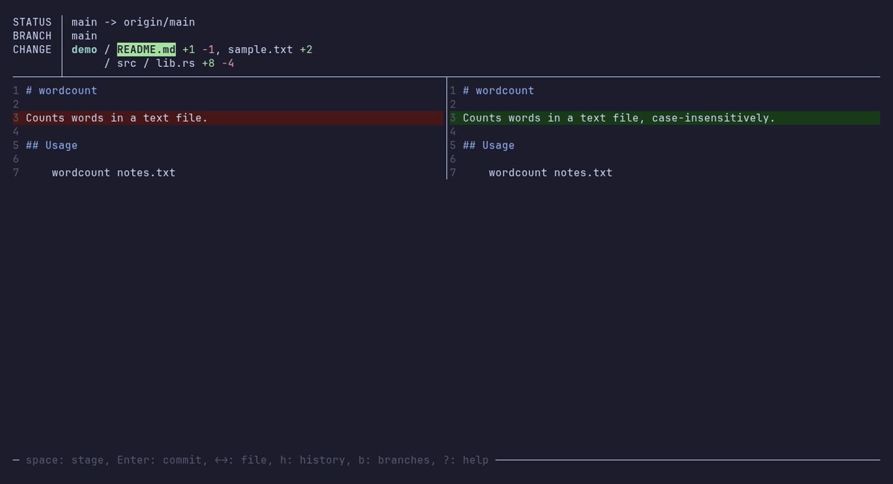

# tit

A minimalist, opinionated terminal UI for git.



tit is not a full git client. It covers the everyday loop — look at changes, stage, commit, pull, push, branch, resolve conflicts — with one obvious key for each. Messages say what happened and what to do next, not raw git errors.

## Install

```sh
cargo install tit
```

Needs git 2.30 or later on `PATH`. tit drives the git CLI directly and does not use libgit2.

## Use

Run `tit` inside a git repository. Press `?` on any screen for its keys.

| Key | Action |
| --- | --- |
| `space` | stage / unstage file |
| `Enter` | commit (`Tab` in the popup amends the last commit) |
| `← →` | previous / next file |
| `u` | discard changes to file |
| `h` / `H` | history of branch / of file |
| `f` | project files, to see a file's history |
| `b` | branches: search, check out, create, merge, delete |
| `p` / `P` | pull / push |
| `s` | sync: pull, then push |
| `S` | stash, pull --rebase, push, pop |
| `r` | resolve conflicts, or finish / abort a stopped merge |
| `e` / `v` | fold identical lines / cycle diff layout |
| `q` | quit |

From history you can revert a commit, cherry-pick it, or start a branch from it.

## Behaviour worth knowing

- Diffs show changed blocks side by side and pure inserts or deletes full width. `v` cycles hybrid, side-by-side and unified; `e` folds identical lines. Both are saved in your global git config as `tit.layout` and `tit.elide`.
- No partial staging. A staged file that is edited again is re-staged in full.
- tit fetches in the background with ssh `BatchMode`, so it never stops to prompt.
- Destructive actions ask first. Force push uses `--force-with-lease --force-if-includes`.

## License

MIT
